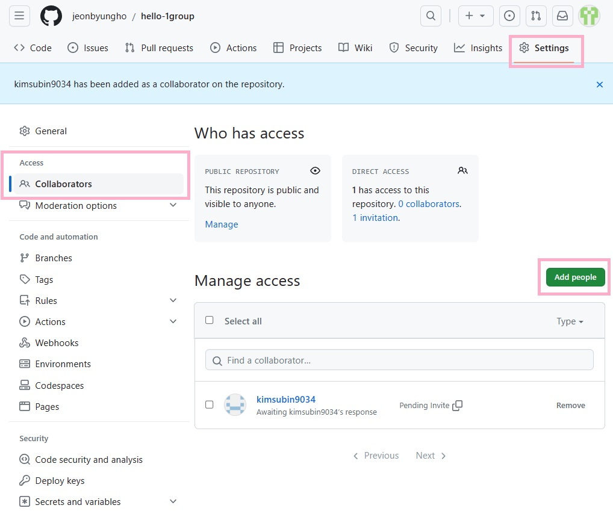

# hello-1group

[Git 공식 튜토리얼](https://git-scm.com/book/ko/v2)

## GitHub 우리 조 인원 초대해보기
[🌐참고 링크](https://docs.github.com/ko/account-and-profile/setting-up-and-managing-your-personal-account-on-github/managing-access-to-your-personal-repositories/inviting-collaborators-to-a-personal-repository)

[🌐참고 링크](https://docs.github.com/ko/repositories/managing-your-repositorys-settings-and-features/managing-repository-settings/managing-teams-and-people-with-access-to-your-repository)



## 브런치 생성

```
> git branch testing
```

## 브런치 이동
```
> git checkout testing
Switched to branch 'testing'
```

## 다른 브런치와 병합
```
> git merge testing
Updating ...
```

## 브런치 목록 전체 보기
```
> git branch
* main
  testing
// *  현 브런치임을 표시.
```

asdasd